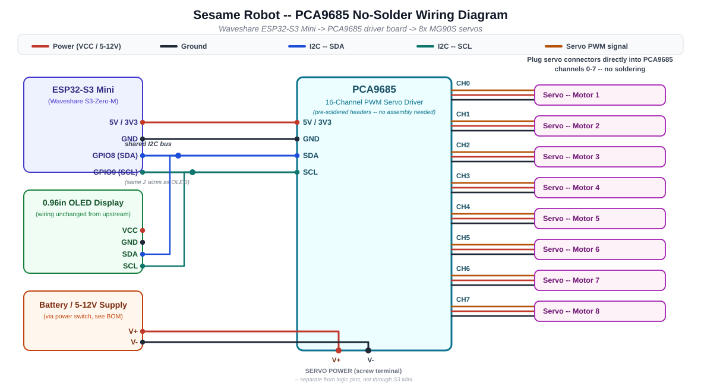
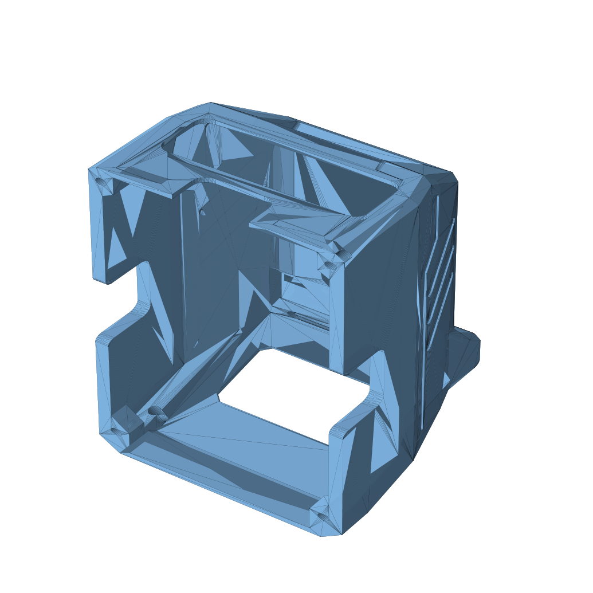

# PCA9685 Fork — No-Solder Servo Wiring

This fork changes exactly one thing about the [mini-ESP32 hand-wired build](../wiring-guide/README.md#how-to-wire-the-lolin-s2-mini--hand-wiring): **how the 8 servos connect to the microcontroller.**

Everything else — the printed parts, the OLED, the firmware's animations/web UI/API, the battery/switch wiring — is unchanged from [upstream](https://github.com/dorianborian/sesame-robot).

## The problem this solves

The stock mini-board build asks you to build a custom 3-pin header breakout on a scrap of protoboard: 8 servo headers side by side, with a single bare wire soldered across all 8 power pins and another across all 8 ground pins, plus 8 individual signal wires. It's a completely reasonable design, but it is a genuinely hard freehand solder job — you're holding a floppy wire in place across 8 points with no third hand free.

## The fix

A **PCA9685 16-channel PWM driver board** (~$14 CAD, [Amazon.ca link](https://www.amazon.ca/PCA9685-Interface-Controller-Compatible-Raspberry/dp/B07RMTN4NZ)) already has 16 sets of pre-soldered 3-pin male headers on it from the factory. Servos plug straight into channels 0–7. The board talks to the microcontroller over I2C — the same 2-wire bus the OLED already uses — so only 4 wires connect the two boards, and with a pre-soldered board like the Waveshare ESP32-S3-Zero-M below, that's zero soldering, period.

## Recommended microcontroller: Waveshare ESP32-S3-Zero-M (pins pre-soldered)

**[Waveshare 3PCS ESP32-S3 Mini (ESP32-S3-Zero-M)](https://www.amazon.ca/dp/B0G43ZYD8G)** — $39.99 CAD for 3 (~$13.30 each), sold by Waveshare themselves, and the listing **explicitly guarantees pre-soldered headers** ("This version is with pre-soldered header"). Correct chip specs for this project: ESP32-S3FH4R2 dual-core 240MHz, 4MB flash / 2MB PSRAM, Wi-Fi + BLE 5, USB-C.

This replaces the original recommendation of a Lolin S2 Mini (ESP32-S2) because no Amazon.ca S2 Mini listing actually guarantees pre-soldered pins — while S3-Zero boards from Waveshare advertise it explicitly. It also happens to be a more capable chip (dual-core vs single-core), fully supported by the same Arduino ESP32 core.

**Pin notes for the S3-Zero-M** (from Waveshare's official pinout):
- I2C for the OLED + PCA9685: **SDA = GPIO8, SCL = GPIO9** (Espressif's conventional S3 default pair; firmware is already configured for these).
- **Do not use GPIO21** — it drives the onboard WS2812 RGB LED. Some older Waveshare FAQ text suggests GPIO21/22 for I2C; that's a copy-paste error, and GPIO22 isn't even broken out on this board.
- Physical pin numbers printed on the silkscreen equal GPIO numbers (very convenient).
- The board is tiny (18 × 23.5mm) — smaller than the S2 Mini, so it packs into the shell easily.

## What changed vs. upstream

| Area | Upstream (S2 Mini hand-wired) | This fork |
|---|---|---|
| Microcontroller | Lolin ESP32-S2 Mini (usually ships bare / unsoldered) | Waveshare ESP32-S3-Zero-M (pre-soldered headers, guaranteed in listing) |
| Servo connection | Solder 8x 3-pin headers + bus wires on protoboard | Plug servos into PCA9685 (pre-soldered) |
| MCU-to-servo wiring | 8 individual GPIO pins, direct PWM | 4 wires (I2C: VCC/GND/SDA/SCL) shared with OLED |
| Firmware servo driver | `ESP32Servo` library, direct `.attach()`/`.write()` | `Adafruit_PWMServoDriver` library over I2C |
| New parts needed | 8x 3-pin headers, protoboard | 1x PCA9685 board (~$14 CAD) |
| Parts no longer needed | — | Protoboard, breakaway headers (for servo wiring specifically) |

## Firmware changes

See [`firmware/sesame-firmware-main.ino`](../../firmware/sesame-firmware-main.ino) in this fork. The diff from upstream is small and contained to 4 spots:

1. `#include <ESP32Servo.h>` → `#include <Adafruit_PWMServoDriver.h>`
2. The `servoPins[8]` GPIO array is replaced with a PCA9685 channel array (`{0,1,2,3,4,5,6,7}`) — motor numbering and leg mapping are unchanged, so all existing animations, the web UI, and the JSON API work exactly as before.
3. `setup()` initializes the PCA9685 over I2C instead of allocating ESP32 PWM timers.
4. `setServoAngle()` converts the angle to a PCA9685 tick count instead of calling `Servo::write()`.

You will need to install the **Adafruit PWM Servo Driver Library** in the Arduino IDE (Library Manager → search "Adafruit PWM Servo Driver") in addition to the libraries already required by upstream.

## Wiring steps

1. Wire the OLED to the S3 Mini: **SDA = GPIO8, SCL = GPIO9** (this fork's firmware default for the S3-Zero-M — note this differs from upstream's S2 Mini pins, GPIO33/35; if you reuse an S2 Mini instead, just uncomment its pin block in the firmware).
2. Connect the PCA9685's VCC/GND/SDA/SCL pins to the S3 Mini's 3V3, GND, GPIO8, and GPIO9 pins respectively. SDA/SCL can be jumped from the same OLED wires (I2C is a shared bus — both devices listen on the same two lines).
3. **Power chain — two phases (zero-solder either way):**
   
   **Phase 1 (tethered, recommended for your first build — no buck, no battery):** USB-C 5V/3A wall adapter → USB-C screw-terminal breakout → PCA9685 servo power screw terminal → tap the V+ pin on the PCA9685's control header (Dupont) → S3 Mini 5V pin. A dedicated 5V/3A source *is* the regulated 3A rail, so no buck converter is needed while tethered. This is also the nicest way to flash/debug — bench-test everything with zero battery-safety concerns.
   
   **Phase 2 (battery, add later — purely additive):** unplug the USB-C breakout, then: Bambu battery (XH2.54) → pre-wired XH2.54 pigtail → pre-wired rocker switch → buck converter (LM2596-class, ~4–38V input) → the *same* PCA9685 screw terminal + the *same* V+ tap. Nothing about the servo or logic wiring changes — the battery+buck simply replaces the wall adapter+breakout at the same two screw terminals. **The buck is required at this stage — the PCA9685 does not regulate the servo rail; V+ passes straight through to the servos, and 7.4V would overvolt them (MG90S max 6V).** Watch the buck's *minimum* input: a 2S pack spends most of its discharge below 8V, so "8–35V input" modules drop out early — pick one rated down to ~7V input. Set the output to exactly 5.0V (verify with the display or a multimeter) before connecting servos.
   
   *"Can't the S3 Mini just provide the 5V?"* — for logic, yes: the OLED and the PCA9685's VCC are milliamps and run fine off the S3 Mini's 3V3 pin. For servos, no: 8× MG90S can burst to **2–4A** under load (the BOM requires a 3A rail), which is ~10× more current than everything else on the robot combined — far beyond what a small dev board's USB connector, PCB traces, and 5V pin can carry (~0.5–1A before sag/damage). It's also a voltage problem: running from the 7.4V battery, the S3 Mini has no onboard 7.4V→5V regulation at all (its regulator is 5V→3.3V for the logic only). And feeding servo current *through* the MCU board causes the exact voltage-sag brownouts that plagued the upstream V2 distro board. Servo power needs its own properly-sized rail — which is either the wall adapter (Phase 1) or the battery+buck (Phase 2).
4. Plug each servo's factory 3-pin connector into PCA9685 channels 0–7, matching "motor 1" → channel 0, "motor 2" → channel 1, etc. so the existing leg/animation mapping lines up.
5. Flash the modified firmware, and everything else (Wi-Fi setup, web UI, Sesame Studio, Companion App) works identically to upstream.

> [!WARNING]
> **Two voltage gotchas:** (1) Never feed the PCA9685's servo V+ terminal more than 6V — always through the 5V buck. (2) Don't plug in the S3 Mini's USB-C while its 5V pin is being powered by the buck — bench-test over USB *or* run from battery, not both at once.

## Bill of materials delta

Add to the BOM:

| Item | Qty | Notes | Source |
|---|---|---|---|
| PCA9685 16-Channel PWM Servo Driver | 1 | Pre-soldered servo headers, I2C control | [Amazon.ca ~$14 CAD](https://www.amazon.ca/PCA9685-Interface-Controller-Compatible-Raspberry/dp/B07RMTN4NZ) |

Remove/optional from the stock "Wiring Option A" BOM (no longer required *for servo wiring* specifically — keep them if you still want spare protoboard/headers for the OLED or switch):

- 3-pin male headers (x8)
- Small protoboard for the servo breakout

## 3D Printing: The "Sunroof" Top Cover

If you want direct access/clearance for the PCA9685 board and its wiring rather
than relying purely on the internal cavity, print `Top-Cover-Enclosed-v117-PCA9685-sunroof.stl`
(in [`hardware/printing/stl/top-covers/`](../../hardware/printing/stl/top-covers/))
instead of the plain `Top-Cover-Enclosed-v117.stl`.

**Important context before you print:** the internal cavity under the top cover is
already ~33mm tall, plenty of room for the PCA9685 board to sit fully enclosed on
the internal frame next to the S3 Mini -- you don't strictly *need* a cutout for the
board to physically fit. A real PCA9685 board (~63 x 25mm) is also larger than the
shell's available flat area (max ~34 x 12mm clear on the crown, avoiding the OLED
window and ear ridges), so this "sunroof" is sized as a **30 x 10mm connector/wire
access and
visual window**, not a full board pass-through. If you'd rather keep the case fully
enclosed, the stock `Top-Cover-Enclosed-v117.stl` works fine with this fork too --
the electronics changes are entirely internal.

Want a different size, shape, or position? The cutout is fully parametric --
see `pca9685-sunroof-cutout.scad` next to the STL for editable dimensions and
re-render instructions.

> [!NOTE]
> **Axis gotcha if you edit the cutout yourself:** the raw STL is stored "lying on
> its side" relative to the assembled robot -- the file's **X axis is true vertical**
> (not Z). This was confirmed by rotating the mesh -90° about Y and matching the
> result against reference photos of the assembled head. The `.scad` script's
> comments explain this in detail; if you're scripting your own cuts against this
> file, cast rays along -X to find the true top surface, not -Z.

## Credits

Original project, hardware, and firmware: [Dorian Todd](https://www.doriantodd.com/) ([dorianborian/sesame-robot](https://github.com/dorianborian/sesame-robot)). This fork only modifies servo wiring/driving — please direct anything unrelated to that upstream, and consider starring/supporting the original project.
